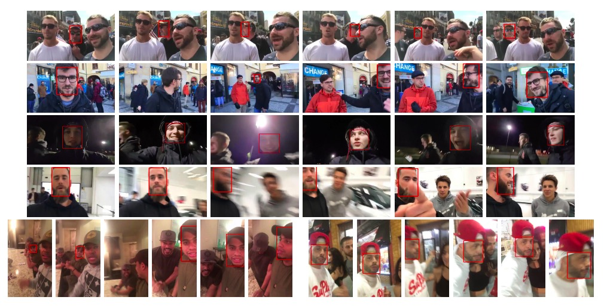

Please fill in the forms at the bottom to request the dataset.  




MobiFace is a novel dataset for mobile face tracking in the wild. It contains 80 unedited mobile live streaming recordings by smartphone users. More than 95K bounding box annotations are provided.  

If you find MobiFace useful, please consider citing:  
```
@misc{lin2018mobiface,
    title={MobiFace: A Novel Dataset for Mobile Face Tracking in the Wild},
    author={Yiming Lin and Shiyang Cheng and Jie Shen and Maja Pantic},
    year={2018},
    eprint={1805.09749},
    archivePrefix={arXiv},
    primaryClass={cs.CV},
    url={https://arxiv.org/abs/1805.09749v2}
}
```

<div class="iframe-container" height="966">
<iframe src="https://docs.google.com/forms/d/e/1FAIpQLSfT817ndiYYBElMxrLhMm5yii16PrBGsYeslETUgLiXl974gg/viewform?embedded=true" width="640" height="886" frameborder="0" marginheight="0" marginwidth="0" allowfullscreen>Loading...</iframe>
</div>
For Chinese visitors:
<div class="iframe-container" height="966">
<iframe height="966" width="640" src="https://wj.qq.com/s/2713056/9e8c/" allowfullscreen>Loading... </iframe>
</div>


